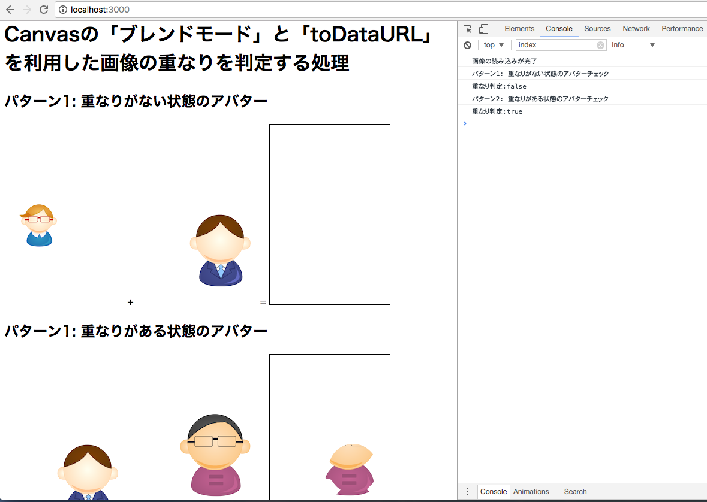

# Canvasで画像の重なりを判定する

Canvasの「ブレンドモード」と「toDataURL」を利用した画像の重なりを判定します。

Canvasのブレンドモードを「source-in」とすることで、canvasには重なる部分だけを描画するというモードで描画処理が行われます。

パターン１では、重なりが無いため、黒枠の部分に何も描画されていませんが、
パターン２では、重なりがあるため、２つの画像が重なっている部分だけが描画されています。

なお、重なっているかどうかの判定処理には、「toDataURL()」で取り出したBase64の値を比較することで実現しています。
（ブラウザのコンソールに実行結果は表示）




## 動作環境

| 対象          | Version  |
| :-----------: |:-------------:|
| OS            | macOS Sierra ver 10.12.3 |
| Node.js       | 7.6.0 |
| Google Chrome | 58.0.3029.110 |

## ローカル環境構築

* レポジトリの取得
   
   ```
   git clone https://github.com/megadreams14/canvasImageOverlap.git
   ```

* Node.jsのバージョン指定
   ```
   nvm use v7.6.0
   ```
   * nvmをインストールされていない方は下記記事を参考
      * [Macにnvm + Node.jsをインストールする](http://qiita.com/dribble13/items/e895208727c85ef9bc52)
      
* ライブラリのインストール
   ```
   npm install
   ```

* サーバの起動
   ```
   node server.js
   ```

* ブラウザでアクセス

   http://localhost:3000/
   
 
